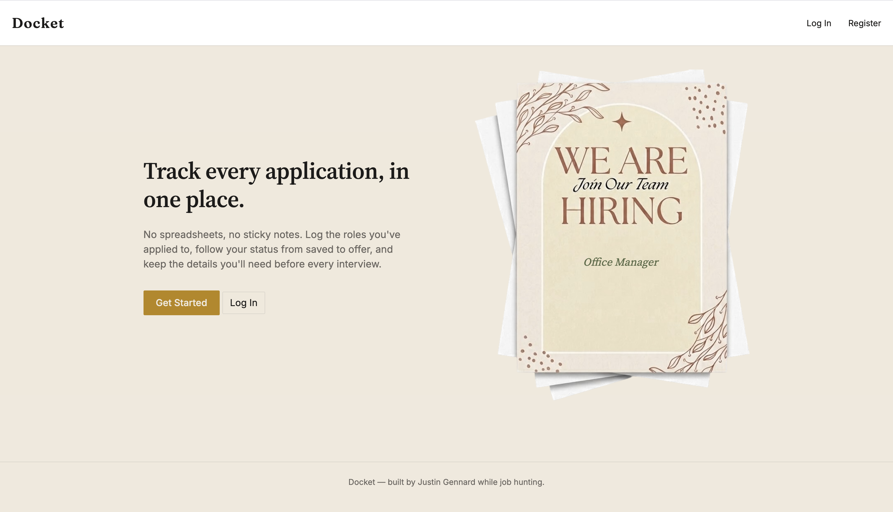

# Docket — Job Application Tracker

A full-stack web app for tracking job applications, built with ASP.NET Core MVC and SQL Server.

## Features
- User authentication (register/login) via ASP.NET Core Identity
- Full CRUD for job applications (create, view, edit, delete)
- Status tracking (Saved, Applied, Interviewing, Offer, Rejected, Withdrawn)
- Client-side filtering by status
- Each user's data is private and scoped to their account

## Tech Stack
- ASP.NET Core MVC (.NET 9)
- Entity Framework Core
- SQL Server (via Docker for local development)
- ASP.NET Core Identity for authentication
- Vanilla JavaScript for client-side interactivity

## Running Locally

**Prerequisites:** .NET SDK, Docker Desktop

1. Clone the repo:

```git clone https://github.com/Estaire/job-application-tracker.git```
```cd job-application-tracker```

2. Start SQL Server in Docker:

```docker run -e "ACCEPT_EULA=Y" -e "MSSQL_SA_PASSWORD=YourPassword" -p 1433:1433 --name sql-dev -d mcr.microsoft.com/mssql/server:2022-latest```

3. Set your connection string as a user secret:

```dotnet user-secrets init```
```dotnet user-secrets set "ConnectionStrings:DefaultConnection" "Server=localhost,1433;Database=JobTrackerDb;User Id=sa;Password=YourStrong@Passw0rd;TrustServerCertificate=True"```

4. Apply migrations:

```dotnet ef database update```

5. Run the app:

```dotnet run```

## Screenshot

### Landing Page


<<<<<<< HEAD

## Live Demo
https://docket-app-jg.azurewebsites.net
=======
>>>>>>> df9317cface032e0f89ddcd7947054f2a720cfe1
